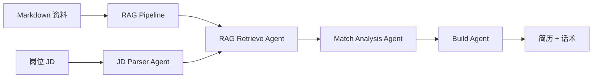

# GitHub README 审查

## 一、当前优点

1. **状态准确**：测试数、已完成模块、技术路线均与实际一致
2. **快速运行命令可用**：clone → pytest → CLI demo → Streamlit 一键可跑
3. **项目结构清晰**：目录树一目了然
4. **协作规则明确**：Codex / Claude Code + DeepSeek / ChatGPT 分工清楚
5. **没有过度包装**：标注了"第一阶段 MVP""规则型""不依赖外部模型"
6. **后续计划透明**：LLM API、LangGraph 标注为 ⏳

## 二、可能需要改进的地方

| 问题 | 严重程度 | 建议 |
|---|---|---|
| 无项目截图 | 中 | 添加终端运行截图和 Streamlit 页面截图 |
| 无架构图 | 中 | 添加 Mermaid 流程图或手绘架构图 |
| 无 Demo 输出示例 | 低 | 可添加关键输出片段的文本示例 |
| 无 Roadmap 时间线 | 低 | 可添加按优先级的 Roadmap 表格 |
| 缺少英文简介 | 低 | 可选，方便国际观众 |

## 三、GitHub 首页是否适合展示

✅ **适合**。项目名称清晰、一句话定位、快速运行、状态透明、项目结构完整。

## 四、过时描述检查

- ✅ 无"尚未实现业务代码"描述
- ✅ 无"Streamlit demo 待完成"描述
- ✅ 无"部署文档待完成"描述
- ✅ 测试数量为 216（与实际一致？需确认：README 未写 216 而是模块明细加总）

> 注：README 中写的是各模块测试数明细，没有写总数 216。建议在表格后加一行 **总计**。

## 五、命令缺失检查

- ✅ clone 命令
- ✅ pytest 命令
- ✅ CLI demo 命令
- ✅ Streamlit 命令
- ✅ 评估 runner 命令
- 缺：`pip install pytest` 的明确提示（在快速运行前）

## 六、截图建议

建议在 `README.md` 适当位置插入：

1. 终端运行 CLI demo 的截图（显示 "任务状态：completed"）
2. Streamlit 浏览器页面的截图（显示 JD 选择 + 分析结果）
3. 评估报告总览表的截图

## 七、Demo 输出示例建议

可以在 README 底部或单独文件添加简短的输出示例：

```markdown
### Demo 输出示例

输入：AI Agent 开发实习生 JD
输出：
- 检索到 5 条相关经历证据
- 匹配分析：10 项 strengths、3 项 weaknesses
- 简历 bullet：基于真实项目经历生成
- 沟通话术：适合联系 HR/mentor 的简短文案
```

## 八、架构图建议

建议添加一张简单的 ASCII 或 Mermaid 架构图：



## 九、Roadmap 建议

| 阶段 | 内容 | 状态 |
|---|---|---|
| Phase 1 | RAG + Agent + CLI + Streamlit | ✅ 完成 |
| Phase 2 | Embedding 检索 + LLM API 接入 | ⏳ 计划中 |
| Phase 3 | GitHub Repo Agent + LangGraph | ⏳ 计划中 |
| Phase 4 | Web 部署 + 多用户 | ⏳ 远期 |

## 总结

README 当前质量 **良好**，信息准确、命令可运行、无过度包装。建议优先添加**截图**和**架构图**来提升展示效果。
